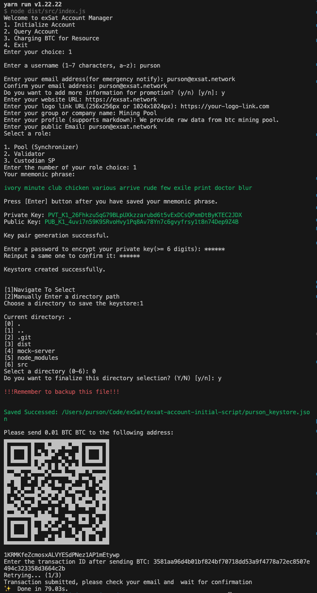
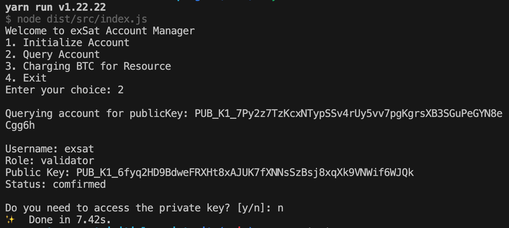
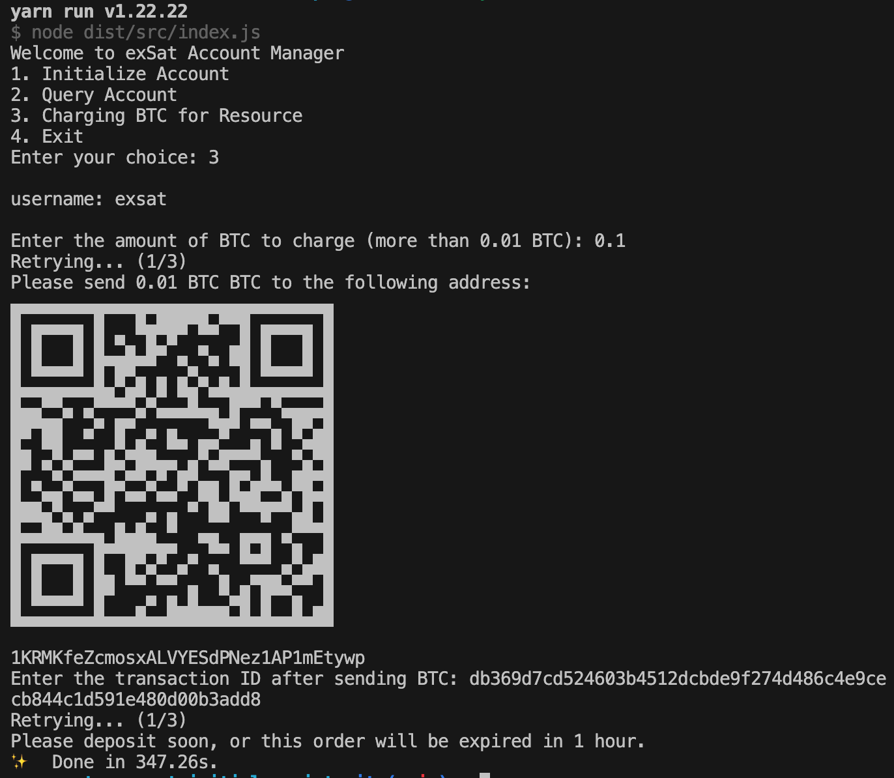
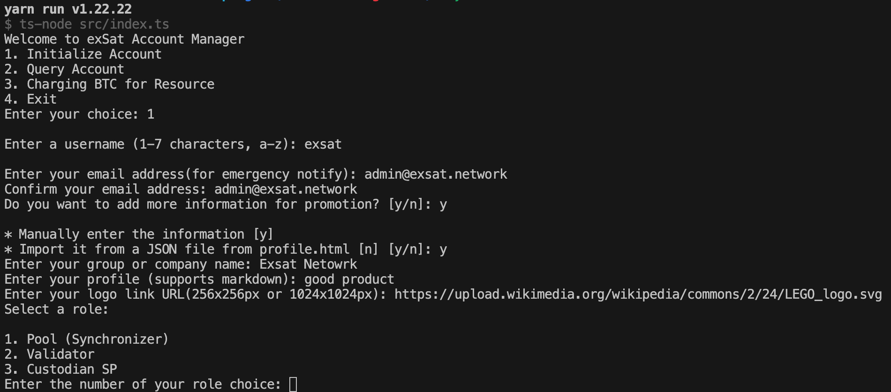
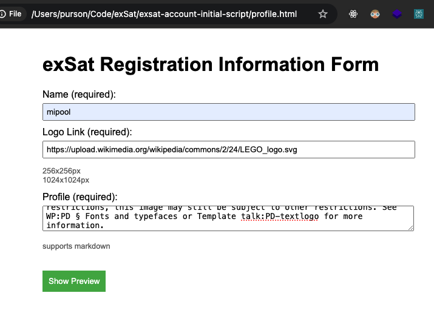
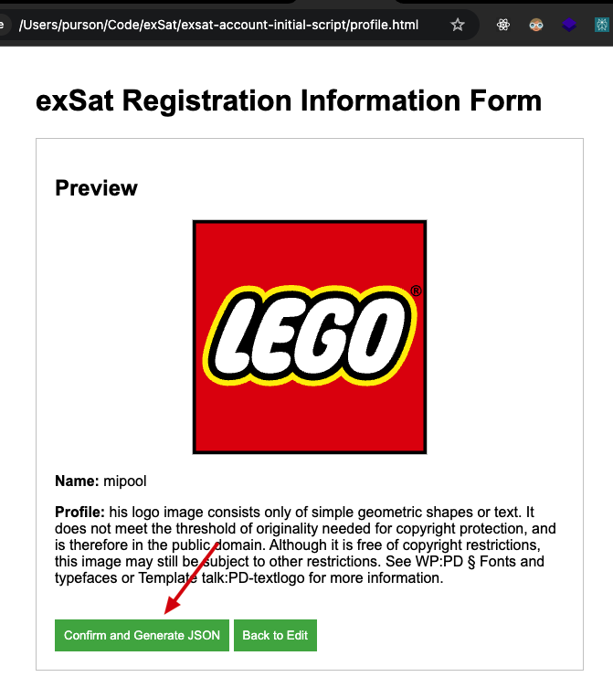
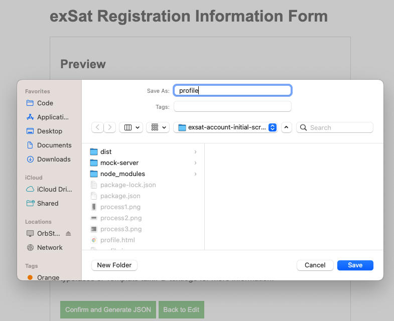
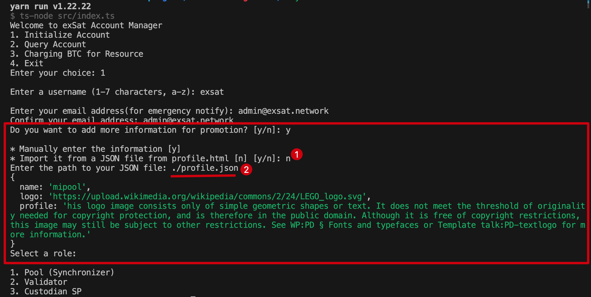

# exSat Account Manager

This project provides a script to manage exSat accounts, including initializing accounts, querying account information, and exiting. The script is written in TypeScript and uses various npm packages for key generation, encryption, and API interactions.

## Main Flow
### 1. Initialize Account



### 2. Query Account



### 3. Charging BTC for Resource



## Optional Flow (belongs to Main Flow 1)

### Initialize Account with profile

#### 1. Add profile manually



#### 2. Add profile generated from `profile.html`

Open `profile.html` in the project root folder.



Click `Confirm and Generate JSON `



Save the generated JSON file.



Enter the path of the JSON file you saved.


## Setup

### Prerequisites

- Node.js (>= 20.x)
- npm (>= 10.x)

### Installation

1. Clone the repository:
    ```sh
    git clone https://github.com/exsat-network/exsat-account-manager-script
    cd exsat-account-manager-script
    ```

2. Create a `.env` file in the root directory and add your API URL and secret key:
    ```sh
    API_URL=https://registry.exactsat.io
    API_SECRET=8f235f31-7fe6-47d5-8ed4-5004c953b3f6
    ```
3. Install the required npm packages:
    ```sh
    yarn 

    yarn start
    ```

4. Build and Package (not finish)
   ```sh
   yarn pkg
   ```

## Mock Data Server

To set up a mock server using `express`, follow these steps:

1. **Ensure `express` and `body-parser` are installed**:

    ```bash
    yarn add express body-parser
    ```

2. **Run the `server.ts` file in the `mock-server` folder**:

  To run the server, use the following command:
  ```sh
  yarn run test-server
  ```

## Directory Structure
```sh
.
├── images
├── mock-server
│   └── server.ts
├── src
│   ├── accountInitializer.ts
│   ├── btcResource.ts
│   ├── constants.ts
│   ├── index.ts
│   ├── menu.ts
│   ├── query.ts
│   ├── types.d.ts
│   ├── utils.ts
│   └── web3.ts
├── tsconfig.json
└── package.json


```